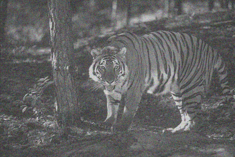

# DnCNN

An implementation of a CNN denoiser!

References: [Beyond a Gaussian Denoiser: Residual Learning of
Deep CNN for Image Denoising][1].

## Description

The denoising convolutional neural network has been implemented here for the purpose of using it as a "plug n play" denoiser. Through this implementation, the DnCNN can be trained and tested using pairs of noisy and clean data.

This network has been trained for noise with <b>standard deviation in the range of 5 to 40.</b>

## Results:

<figure>
  
  <figcaption>Noisy image of a Tiger</figcaption>
</figure>

<br><br>

<figure>
  
  <figcaption>Denoised image of the Tiger</figcaption>
</figure>

<br><br>

<figure>
  
  <figcaption>Noisy image of a plane</figcaption>
</figure>

<br><br>

<figure>
  
  <figcaption>Denoised image of the plane</figcaption>
</figure>

<br><br>

 <table style="width:100%">
  <tr>
    <th>Image</th>
    <th>Standard Deviation of Noise</th>
    <th>Input PSNR(dB)</th>
    <th>Input SSIM</th>
    <th>Output PSNR(dB)</th>
    <th>Output SSIM</th>
  </tr>
  <tr>
    <td>Tiger</td>
    <td>25</td>
    <td>16.53</td>
    <td>0.5914</td>
    <td>29.16</td>
    <td>0.9233</td>
  </tr>
  <tr>
    <td>Plane</td>
    <td>35</td>
    <td>12.83</td>
    <td>0.4875</td>
    <td>21.73</td>
    <td>0.9105</td>
  </tr>
</table> 

## Getting Started

### Dependencies
* Python >= 3.6

### Installing
```
  git clone https://github.com/Aaatresh/DnCNN
```

### Executing program

Run cells of:
```
   ./code/DnCNN_sigmix.ipynb on jupyter notebook
```
for a range of standard deviations of noise.

Run cells of:
```
   ./code/DnCNN_sig25.ipynb on jupyter notebook
```
for a standard deviations of noise = 25.


## Authors
Contributors names and contact info:
* Anirudh Aatresh (aaa.171ec106@nitk.edu.in)

## Version History
* 0.1
    * Initial Release

## License

This project is licensed under the MIT License - see the LICENSE file for details


  [1]: <https://ieeexplore.ieee.org/document/7839189>
